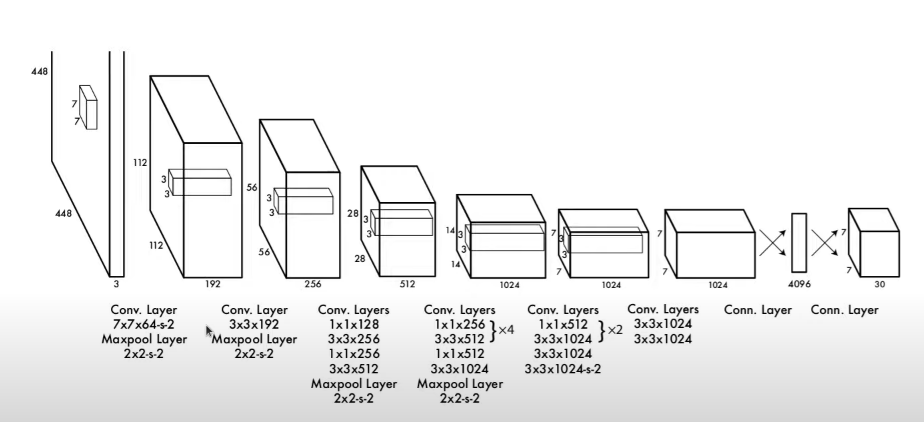
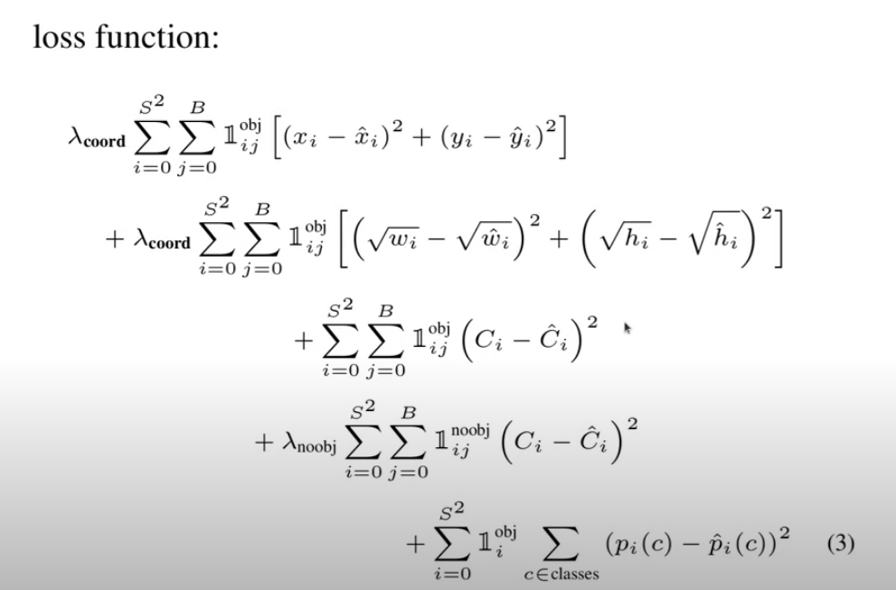

# YOLO object detection
In this repository you will find a "copy" implementation of the yolo algorithm based on [Aladdin](https://github.com/aladdinpersson/Machine-Learning-Collection)

## Goal
The goal of this repository was to complete an exercise to be able proceed with my application to a company. I was to demonstrate the usage of a deep-learning model, such as object detection. My choice landed upon the YOLO (V1) algorithm

## Introduction to the algorithm
- The architecture and loss function is based on the paper: [You Only Look Once: Unified, Real-Time Object Detection by Joseph Redmon, Santosh Divvala, Ross Girshick, Ali Farhadi](https://www.cv-foundation.org/openaccess/content_cvpr_2016/papers/Redmon_You_Only_Look_CVPR_2016_paper.pdf)
- The detection network has 24 convolutional layers followed by 2 fully connected layers. Alternating 1 × 1 convolutional layers reduce the features space from preceding layers.

- I (and the paper) used the PASCAL VOC dataset, which can be obtained from the original VOC site, but I used a preprocessed version, which can be downloaded from [here](https://www.kaggle.com/dataset/734b7bcb7ef13a045cbdd007a3c19874c2586ed0b02b4afc86126e89d00af8d2). It is a dataset containing 40000 images with labels for classes and bounding boxes for all of them (there are 20 classes).
- The loss function goes as follows 

The idea is that the YOLO predicts multiple bounding boxes per grid cell (in our case 2).

During training we only want box predictor to be responsible for each object, we decide that by taking the highest current IOU (intersection over union) with the ground truth (the given box). We can achieve this via an identity function (Iobj_ij).

Iobj_i is 1 if an object appears in cell i, 0 otherwise
Iobj_ij is 1 if Iobj_i is 1 AND the jth box in cell i is responsible for the object.

The loss function is composed of 4 parts:
- It takes the sum squared error of the midpoints of the ground truth and the predicted (with prio lambda coord)
- Plus the sum squared error of the square rooted heights and widths (with prio lambda coord)
- Plus the probability of there being an object in the cell
- Plus the probability that there is no object in the cell (accomplished by noobj identity function, works the same as the obj identity functions but negated with prio lambfa NOOBJ)
- Plus the sum squared error of the classes (deviation from the target class)

These make it so that we use a regression-based loss on everything, which simplifies the loss function a bit

## Utilities that were used
- **Intersection over union (IOU)**: it's a measure to determine how "good" a bounding box is compared to the ground truth IOU > 0.5 is "decent", IOU > 0.7 "good" and so on.
- **Non-max surpression**: it's a technique to clean up multiple bounding boxes for one object. We use IOU for that -> we take the bounding box with the highest confidence of a class and we take the IOU of that bounding box with every other box, and discard the boxes, where IOU > 0.5 (or some threshold). We can improve this by discarding the boxes with low confidences (below 0.1 or something). For multiple object on an image, we only calculate the IOU for bounding boxes of the same class.
- **Mean average precision**:
    1. We get all of the bounding boxes for the test set and for each of them we check whether they are True Positive(TP) or False Positive(FP)
    2. We sort them by descending confidence score
    3. We calculate the precision and recall as we go through all of the predictions
       - Precision: TP divided by the union of TP and FP (of all the predictions, what fraction was actually correct)
       - Recall: TP divided by the union of TP and FN (false negatives, in other words of all target bounding boxes, what fraction did we correctly detect)
    4. We plot the Precision-Recall graph 
    5. We calculate the area under the curve
    6. We calculate 1-5 for every class and we get the mean of every class
    7. We calculate 1-6 again for many IOUs for example from 0.5 to 0.95 by a 0.05 step (in the paper this is written as mAP@0.5:0.05:0.95)
